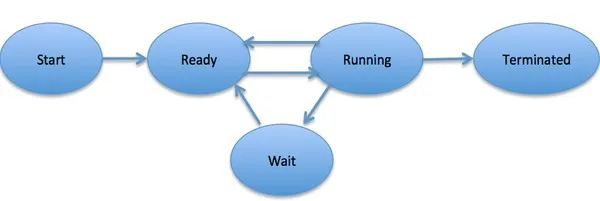

# Process Management

### What is a computer process?

In computing, a process is an instance of a computer program that is being executed. It contains the program code and its current activity. A process is a fundamental concept in the operating system, which is responsible for managing and executing processes on a computer.

***

### What are the components of a process?

**Stack:** Contains temporary data such as function parameters, return addresses, and local variables.

**Heap** : This is dynamically allocated memory to a process during its run time.

**Text** : The executable instructions of a program

**Process Control Block :** A data structure used by the operating system to store all information about a process. This includes:

* Process state (new, ready, running, waiting, terminated)
* Process ID (unique identifier)
* Program counter
* CPU registers
* Memory management information (pointers to the process’s address space)
* I/O status information
* Accounting information (e.g., CPU usage, time limits)

***

### What are the states of a process?

**Start:** The initial state when a process is first started.

**Ready:** The process is waiting to be assigned to a processor. Ready processes are waiting to have the processor allocated to them by the operating system so that they can run. A process may come into this state after the **Start** state, or while running it by but getting interrupted by the scheduler to assign CPU to some other process.

**Running:** Once the process has been assigned to a processor by the OS scheduler, the process state is set to running and the processor executes its instructions.

**Waiting:** the process moves into the waiting state if it needs to wait for a resource, such as waiting for user input, or waiting for a file to become available.

**Terminated or Exit:** Once the process finishes its execution, or it is terminated by the operating system, it is moved to the terminated state where it waits to be removed from main memory.

<figure><figcaption>
Source: How Operating Systems Work: 10 Concepts you Should Know as a Developer - James Le
</figcaption></figure>

