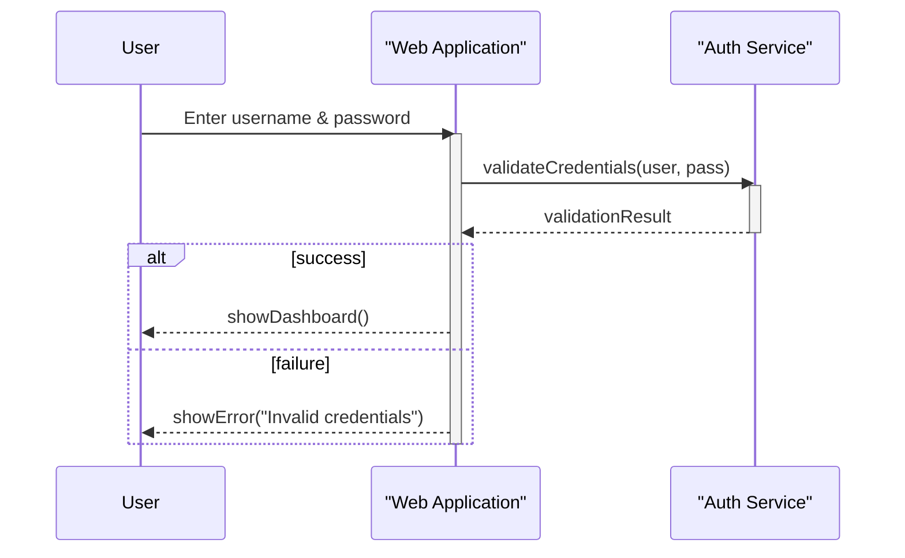
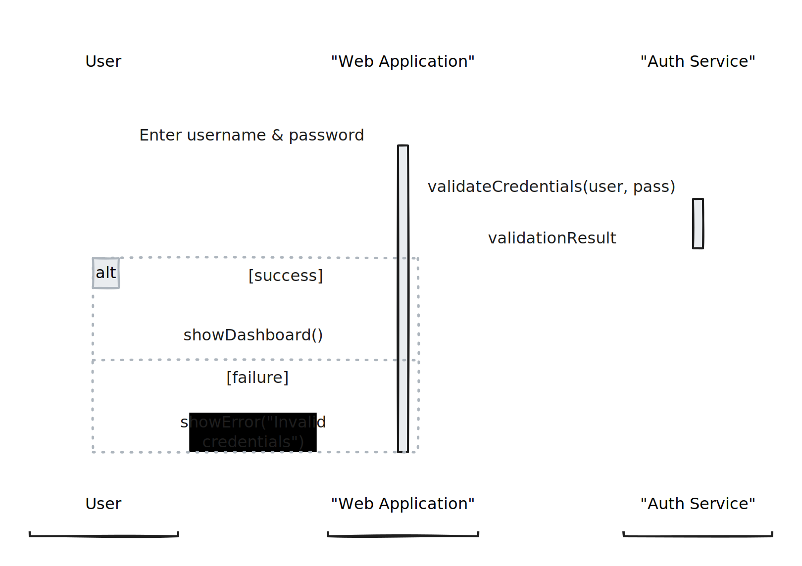

# Sequence Diagram

### 1. What Is a Sequence Diagram?

A UML Sequence Diagram models the interaction between objects or components over time. It shows the order of messages exchanged to carry out a process or use case.

***

### 2. Key Components & Legend

| Symbol / Element           | Notation / Appearance               | Description                                                   |
| -------------------------- | ----------------------------------- | ------------------------------------------------------------- |
| **Participant / Lifeline** | Participant name                    | Vertical dashed line representing an object or actor.         |
| **Activation Bar**         | Narrow rectangle on a lifeline      | Denotes the period an object is active/controlling the flow.  |
| **Synchronous Message**    | Solid line with a filled arrowhead  | Caller waits for the operation to complete before continuing. |
| **Asynchronous Message**   | Solid line with an open arrowhead   | Caller sends the message and continues without waiting.       |
| **Return Message**         | Dashed line with an open arrowhead  | Indicates a response or return value from an operation.       |
| **Notes / Comments**       | Text box connected by a dotted line | Additional information or annotations.                        |

***

### 3. Steps to Create a Sequence Diagram

1. **Identify the Scope**: Define the use case or scenario (e.g., "User logs in").
2. **List Participants**: Determine the actors and system components involved.
3. **Draw Lifelines**: For each participant, draw a vertical dashed line.
4. **Add Activation Bars**: Show when a participant is active by adding narrow rectangles on lifelines.
5. **Sequence Messages**:
   * Use synchronous messages for calls where the sender waits.
   * Use asynchronous messages when the sender doesn’t wait.
   * Label each message with its action or method name.
6. **Include Return Messages**: Represent responses or data returned.
7. **Annotate with Notes**: Add clarifications or decisions as needed.
8. **Validate Flow**: Walk through the diagram step-by-step to ensure correctness.

***

### 4. Example: User Login Flow

**Scenario:** A user enters credentials to log into a web application.

**Explanation of Flow:**

1. **User** submits credentials to the **Web Application**.
2. **Web Application** activates and calls the **Auth Service**.
3. **Auth Service** processes and returns a result.
4. The **Web Application** then displays either the dashboard or an error.

***

#### Tips

* Keep messages concise and descriptive.
* Only include lifelines relevant to the scenario.
* Use combined fragments (e.g., `alt`, `opt`) for conditional flows.
* Group complex interactions using frames (e.g., `loop`, `parallel`).

***

_You now have the fundamental steps, legend, and a working example to start designing your own sequence diagrams!_
