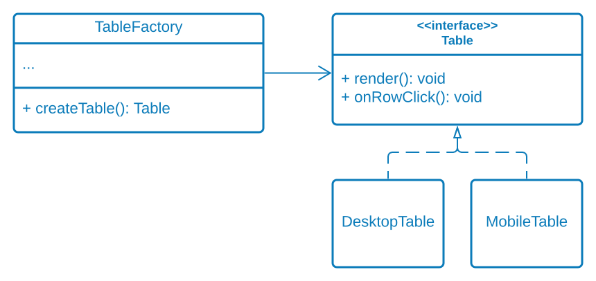

# Factory Method

## Description

Factory Method is a creational design pattern that provides an interface for creating objects in a superclass, but allows subclasses to alter the type of objects that will be created.

## Diagram



## Code

Enum to avoid magic strings and provide intellisense

```typescript
enum DeviceType {
    Desktop,
    Mobile
}
```

The abstract "product"

```typescript
interface Table {

    render(): void;

    onRowClick(): void;

}
```

A concrete "product"

```typescript
class DesktopTable implements Table {

    public onRowClick(): void {
    }

    public render(): void {
        console.log('Rendered desktop table');
    }

}
```

A concrete "product"

```typescript
class MobileTable implements Table {

    public onRowClick(): void {
    }

    public render(): void {
        console.log('Rendered mobile table');
    }

}
```

The "creator"

```typescript
class TableFactory {

    public static createTable(deviceType: DeviceType): Table {

        if (deviceType == DeviceType.Desktop) {
            return new DesktopTable();
        }

        if (deviceType == DeviceType.Mobile) {
            return new MobileTable();
        }

        throw new Error('Device type not found');
    };

}
```

Client code (the consumer)

```typescript
class Application {

    private desktopTable: Table;
    private mobileTable: Table;

    private onStartup(): void {

        this.desktopTable = TableFactory.createTable(DeviceType.Desktop);
        this.mobileTable = TableFactory.createTable(DeviceType.Mobile);

        this.desktopTable.render();
        this.mobileTable.render();
    }
}
```
